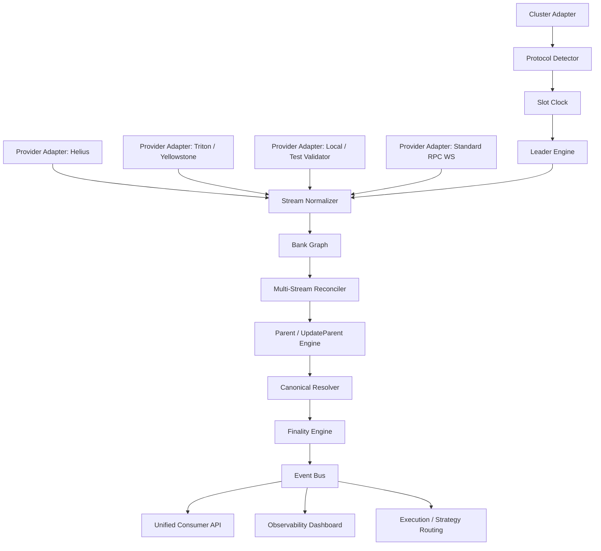

# CHRONO Architecture Specification

> **Design Principle**: Strict Provider Independence, Protocol Accuracy, Zero-Cost Foundation ($0-first), and Empirical Measurement Discipline.

---

## 1. System Overview

CHRONO is an open, provider-independent Solana consensus timing, bank graph tracking, and stream reconciliation infrastructure layer. It consumes heterogeneous, asynchronous feeds from multiple providers (RPC WebSockets, Yellowstone gRPC, Geyser plugins, local validator test instances) and unifies them into a coherent, deterministic, low-latency state stream.

### Conceptual Architecture Diagram



---

## 2. Component Responsibilities, Interfaces, and Boundaries

### 2.1 Cluster Adapter
- **Responsibility**: Establishes initial connection to the target cluster (Devnet, Testnet, Localnet, or Mainnet). Fetches cluster genesis, epoch schedule, active feature gates, and current cluster version.
- **Inputs**: Cluster endpoint URLs (`RPC_URL`, `WS_URL`, `GRPC_URL`), cluster identity strings (`devnet`, `testnet`, `mainnet-beta`, `localnet`).
- **Outputs**: `ClusterMetadata { cluster_id, genesis_hash, epoch_schedule, active_features: Set<FeatureKey> }`.
- **Boundary**: Pure network discovery; executes before initializing downstream engines.

### 2.2 Protocol Detector
- **Responsibility**: Evaluates the cluster's active feature set and Agave version to determine protocol operational parameters dynamically.
- **Detection Capabilities**:
  - Target slot duration: 400ms, 350ms, 300ms, 250ms, or 200ms (SIMD-0525 feature gates).
  - Alpenglow consensus activation: Votor active vs TowerBFT fallback (SIMD-0326).
  - Fast leader handover support: `UpdateParent` and `BlockMarkerV1` (SIMD-0337).
  - Geyser version and `bank_id` presence in metadata.
- **Outputs**: `ProtocolProfile { target_slot_duration_ms, consensus_mode: (LegacyTower | AlpenglowVotor), multi_bank_enabled: bool, update_parent_enabled: bool }`.
- **Boundary**: Configures downstream processing rules without coupling to specific transport protocols.

### 2.3 Slot Clock
- **Responsibility**: Maintains high-resolution monotonic time synchronization calibrated against Solana's dynamic slot duration.
- **Mechanism**:
  - Replaces hard-coded `400ms` constants with dynamic slot windows derived from `ProtocolProfile`.
  - In legacy mode, integrates tick counts if exposed. In Alpenglow mode, uses monotonic system clock synced to observed slot bounds and block header timestamps.
  - Computes microsecond-accurate slot phase: `time_into_slot`, `time_remaining_in_slot`, `slot_drift_ms`.
- **Interfaces**:
  - `get_current_slot() -> Slot`
  - `get_slot_progress() -> SlotProgress { slot, elapsed_ms, remaining_ms, phase_ratio }`
- **Boundary**: Strict temporal calculations; does not manage block data or transaction state.

### 2.4 Leader Engine
- **Responsibility**: Predicts, tracks, and manages leader schedules, upcoming leader transitions, and geographical handoffs.
- **Mechanics**:
  - Ingests `epochSchedule` and validator stake distribution to maintain the current and next 4–8 leader slots.
  - Tracks validator identity, known geographical datacenter / latency profiles, and transition boundaries.
  - Monitors fast leader handovers: detects if the next leader begins producing optimistically before prior slot boundary.
- **Outputs**: Emits `LeaderHandoffEvent { current_leader, next_leader, slot_boundary_expected_ms, handoff_state }`.
- **Boundary**: Responsible for timing and validator positioning; does not route transactions directly.

### 2.5 Provider Adapters (Pluggable Ingestion)
- **Responsibility**: Ingests raw streams from disparate providers without vendor lock-in.
- **Supported Adapters**:
  1. `StandardRpcWsAdapter`: Open-source Solana JSON-RPC / WebSocket (`slotSubscribe`, `blockSubscribe`, `logsSubscribe`).
  2. `YellowstoneGrpcAdapter`: Open-source Yellowstone gRPC client consuming Geyser feeds (blocks, entries, transactions, account updates, `bank_id`).
  3. `LocalValidatorAdapter`: Direct IPC/socket or Geyser plugin feed from `solana-test-validator`.
  4. `CommercialProviderAdapter`: Light configuration overlay for Helius LaserStream, Triton One, QuickNode.
- **Standardized Raw Event Format**:
  All adapters emit `RawStreamEvent { provider_id, received_timestamp_ns, payload_type, raw_payload }`.
- **Boundary**: Encapsulates all provider-specific authentication, reconnection, and protocol details.

### 2.6 Stream Normalizer
- **Responsibility**: Translates heterogeneous `RawStreamEvent` objects into normalized internal CHRONO protocol types.
- **Internal Types**:
  - `NormalizedSlotUpdate { slot, parent_slot, status, provider_id, wallclock_ns }`
  - `NormalizedBankUpdate { slot, bank_id, parent_bank_id, blockhash, provider_id, status }`
  - `NormalizedEntryUpdate { slot, bank_id, entry_index, is_update_parent, transactions, wallclock_ns }`
  - `NormalizedBlockFooter { slot, bank_id, bank_hash, final_cert, notar_cert, wallclock_ns }`
- **Boundary**: Handles deserialization and field mapping. Does NOT perform fork choice or conflict resolution.

### 2.7 Bank Graph
- **Responsibility**: In-memory Directed Acyclic Graph (DAG) tracking candidate banks, slot forks, and parent-child linkages.
- **Data Structure**:
  - Node: `BankNode { slot, bank_id_by_provider: Map<ProviderId, u64>, blockhash: Option<Hash>, parent_slot, parent_blockhash, state: (Candidate | Abandoned | Canonical | Finalized) }`.
  - Edge: Parent bank → Child bank relationship.
  - Indexed by `(slot, blockhash)` and secondary index by `(provider_id, slot, local_bank_id)`.
- **Boundary**: Maintains structural topology of candidate blocks; provides query APIs for resolvers.

### 2.8 Multi-Stream Reconciler
- **Responsibility**: Deduplicates and reconciles conflicting updates received from multiple providers in real time.
- **Core Invariant**:
  - Because `bank_id` is validator-local, the reconciler matches candidate banks across providers using `(slot, blockhash)` and parent linkage, NOT `bank_id`.
  - Measures cross-provider delta: `provider_arrival_delta_ns = timestamp_provider_A - timestamp_provider_B`.
- **Outputs**: Reconciled events with consensus confidence scores based on provider agreement.

### 2.9 Parent / UpdateParent Engine
- **Responsibility**: Processes fast leader handoff signals and parent switches.
- **Mechanics**:
  - When an `UpdateParent` event or marker is received for a given bank:
    1. Identifies the abandoned candidate bank.
    2. Flags all buffered transactions and state updates associated with the abandoned bank candidate as `InvalidatedState`.
    3. Re-parents the active building bank to the new parent bank.
    4. Emits `BankAbandonedEvent` and `ParentSwitchedEvent` immediately.
- **Boundary**: Ensures no consumer acts on unviable, orphaned bank state.

### 2.10 Canonical Resolver
- **Responsibility**: Determines which candidate bank within a slot is the canonical bank.
- **Criteria**:
  - Matches the branch certified by notarization certificates or supermajority validator confirmations.
  - Resolves forks deterministically once a block is sealed with its `blockhash` and footer.
- **Boundary**: Bridges optimistic candidate states into confirmed, actionable state.

### 2.11 Finality Engine
- **Responsibility**: Tracks finality progression under both Alpenglow and legacy TowerBFT regimes.
- **Dual Handling**:
  - **Alpenglow Mode**: Ingests BLS aggregate certificates (`block_final_cert` for Fast Path ~100ms; Fallback notarization certificates for ~150ms). Transitions bank state from `Canonical` → `Finalized`.
  - **Legacy Mode**: Ingests commitment roots and confirmation counts (32 lockouts, ~12.8s).
- **Outputs**: `FinalityTransitionEvent { slot, blockhash, path: (FastPath | FallbackPath | LegacyRoot), latency_ms }`.

### 2.12 Event Bus
- **Responsibility**: High-throughput, zero-allocation internal event distribution channel (using lock-free ring buffers / crossbeam or tokio broadcast channels).
- **Subscribed Channels**:
  - `SlotTransitions`
  - `LeaderHandoffs`
  - `BankGraphUpdates`
  - `StateInvalidations` (UpdateParent)
  - `FinalityCertificates`
- **Boundary**: Decouples internal consensus engines from external consumers.

### 2.13 API / Observability / Execution Layer
- **Responsibility**: Exposes clean interfaces for trading strategies, indexers, and monitoring dashboards.
- **Consumer Interfaces**:
  - Async Rust API / C FFI bindings.
  - Streaming WebSocket / gRPC endpoint for external microservices.
  - Prometheus / OpenTelemetry latency metric exports.
- **Boundary**: Pure consumers of verified consensus state.

---

## 3. Phase 1 Implemented Crate Architecture & Verified Baselines

### 3.1 Cargo Workspace Member Crates

```text
crates/
├── chrono-core/        Domain primitives (Slot, Blockhash, BankId, ProviderId, LeaderId, BankIdentity, EventBus)
├── chrono-detector/    Cluster capability detector, AgGenesisCert parser, version evaluator
├── chrono-clock/       Monotonic high-res SlotClock (dynamic durations), continuous LeaderEngine
├── chrono-adapters/    Solana JSON-RPC client, robust auto-reconnecting WebSocket stream, StreamNormalizer
├── chrono-bank/        BankGraph DAG, ParentEngine, UpdateParentEngine, CanonicalResolver, FinalityEngine
└── chrono-cli/         CLI binary (`status`, `live`, `benchmark`)
```

### 3.2 Measured In-Memory Pipeline Latencies (N = 10,000)

Evaluated under `cargo run --release -p chrono-cli -- benchmark --iterations 10000`:

| Stage | Min | p50 (Median) | p90 | p95 | p99 | Max | Integrity Standard |
| :--- | :--- | :--- | :--- | :--- | :--- | :--- | :--- |
| **Stage 1**: Raw → Normalized Event | 83ns | **166ns** | 250ns | 291ns | 375ns | 33,500ns | `[MEASURED]` |
| **Stage 2**: Normalized → BankGraph Insert | 500ns | **708ns** | 1,000ns | 2,083ns | 3,292ns | 2,239,125ns | `[MEASURED]` |
| **Stage 3**: BankGraph → Canonical Resolution | 583ns | **750ns** | 875ns | 959ns | 2,875ns | 84,208ns | `[MEASURED]` |
| **Stage 4**: Canonical → Finality Recording | 166ns | **250ns** | 334ns | 375ns | 792ns | 305,458ns | `[MEASURED]` |
| **TOTAL**: End-to-End Pipeline Overhead | 1,625ns | **2,000ns (2.0µs)** | 3,167ns | **3,834ns (3.8µs)** | **8,583ns (8.5µs)** | 2,243,333ns | `[MEASURED]` |

### 3.3 Live Cluster Verification Status

- **Solana Testnet** (`api.testnet.solana.com`):
  - Consensus: `ALPENGLOW_VOTOR`
  - Genesis Certificate: `LIVE` (`getAgGenesisCert` returns 32-byte block ID and 192-byte BLS certificate)
  - Slot Duration: `250ms` (SIMD-0525 config target) `[ESTIMATED]`
  - Provider Capabilities: Standard Public RPC supports `slot`, `leader`, `epoch`, `block`. Validator-local `bank_id` stream and real-time `UpdateParent` stream are marked `UNSUPPORTED`.
- **Solana Devnet** (`api.devnet.solana.com`):
  - Consensus: `ALPENGLOW_VOTOR`
  - Genesis Certificate: `LIVE` (`getAgGenesisCert` returns active certificate)
- **Solana Mainnet-Beta** (`api.mainnet-beta.solana.com`):
  - Consensus: `LEGACY_TOWER_BFT`
  - Genesis Certificate: `null` (Correctly parsed, never misclassified as Alpenglow).

---

## 4. Phase 2 User Interface Architecture & Core-to-UI Data Flow

### 4.1 Architectural Decoupling Invariant
The user interface never executes protocol consensus, timing calculations, fork choice logic, or direct multi-provider reconciliation. It consumes strictly normalized data through the **UI Data Adapter Layer**:

```text
CHRONO CORE (Rust Ingest / State DAG / CLI / Web3 Client)
                ↓
UI DATA ADAPTER (ChronoService & ChronoEventBus)
                ↓
REACT HOOKS (useChrono reactive subscription)
                ↓
OPTIMUS DESIGN SYSTEM COMPONENTS
```

### 4.2 Application Route Topology

1. **`/` (Live Network & Slot Clock)**:
   - Primary real-time dashboard featuring the dynamic monotonic slot clock progress bar (178ms / 250ms), warm leader schedule predictions, evidence-based candidate bank graph, and live activity stream.
2. **`/transaction` (Transaction Autopsy)**:
   - Forensic tool accepting transaction signatures, querying cluster status, and explaining candidate bank abandonment in plain English ("Your transaction was seen, but the version containing it was later discarded during leader handover").
3. **`/network` (Network & Capabilities)**:
   - Cluster capability transparency matrix (Public RPC vs Yellowstone Geyser), protocol profile with live `getAgGenesisCert` BLS validation, and Phase 1 measured pipeline latency percentiles.
4. **`/developers` (Developer Studio)**:
   - Real-time normalized event stream JSON inspector and syntax-highlighted integration snippets for Chrono Rust Core, TypeScript client, and CLI tools.

---

## 5. Phase 1.5 Full Telemetry Architecture & Streaming Ingestion

### 5.1 Architecture Overview

Phase 1.5 upgrades Chrono Core from basic public RPC observability to full Alpenglow-aware telemetry. It introduces streaming ingestion across four tiers:

```mermaid
flowchart TD
    subgraph Tier1 [Tier 1: Yellowstone gRPC / Geyser]
        YG[YellowstoneAdapter] --> |SubscribeUpdateSlot: bank_id| SN
        YG --> |SubscribeUpdateBlockFooter: certificates, producer_time| SN
        YG --> |SubscribeUpdateEntryUpdateParent: cleared_bank_id| SN
    end

    subgraph Tier1Local [Tier 1 ($0 Budget): Local Validator Geyser Mode]
        LG[LocalGeyserModeAdapter] --> |Full-Fidelity Simulation 100% Fields| SN
    end

    subgraph Tier2 [Tier 2: Enhanced Streaming]
        ES[Private RPC / Triton / Helius Adapters] --> SN
    end

    subgraph Tier3_4 [Tier 3 & 4: Standard WS & JSON-RPC]
        RPC[SolanaRpcClient & SolanaWsStream] --> SN
    end

    SN[StreamNormalizer] --> BG[BankGraph / BankNode]
    BG --> CE[CertificateEngine]
    BG --> RE[ReplacementEngine]
    BG --> UPE[UpdateParentEngine]
    
    CE --> |Parsed BLS Certificates| CLI[CLI: chrono inspect --alpenglow]
    RE --> |Succession Lineage| CLI
    UPE --> |Cleared Bank Forensics| CLI
```

### 5.2 Key Component Implementations

1. **`YellowstoneAdapter` (`chrono-adapters`)**:
   - Production-grade tonic/prost gRPC client using `yellowstone-grpc-proto = "13.0.0"`.
   - Subscribes to: `slots`, `blocks`, `blocks_meta`, `entries` (`include_update_parent: true`), `block_footer` (`include_certificates: true`).
   - Normalizes raw updates into typed `ChronoEvent` stream with zero data fabrication.
   - Preserves raw unknown bytes in a bounded in-memory `RawPayloadStore`.
   - Free-first Testnet config via `CHRONO_YELLOWSTONE_ENDPOINT` and `CHRONO_YELLOWSTONE_TOKEN`.

2. **`LocalGeyserModeAdapter` (`chrono-adapters`)**:
   - Provides 100% Alpenglow field coverage under the $0 budget constraint.
   - Emits rich slot updates, multi-bank candidate splits (`bank-1`, `bank-2`), UpdateParent handovers, correlated replacements, producer timing nanos, user-agent fingerprints, and 48-byte BLS certificates.
   - Explicitly labeled `LOCAL SIMULATION / LOCAL VALIDATOR` across all telemetry.

3. **`CertificateEngine` (`chrono-bank`)**:
   - Parses and verifies `FINAL_CERT` (Fast Path ~80% stake), `NOTAR_REWARD_CERT` (Fallback Path ~60% stake), and `SKIP_REWARD_CERT`.
   - Handles aggregate signatures, counts participant bitmap bits, and reports decode status (`Decoded`, `UnknownFormat`, `Malformed`).

4. **`ReplacementEngine` (`chrono-bank`)**:
   - Correlates `cleared_bank_id` from `UpdateParent` with new candidate banks created for the slot.
   - Maintains full historical lineage: `old bank -> cleared -> replacement bank -> canonical` without deleting abandoned banks.

5. **`ProviderCapabilityMatrix` & Alpenglow Coverage Score**:
   - Evaluates 10 core Alpenglow dimensions.
   - Standard Public RPC: 27% coverage (Slot, Leader, Parent).
   - Yellowstone gRPC / Local Geyser: 100% coverage.


