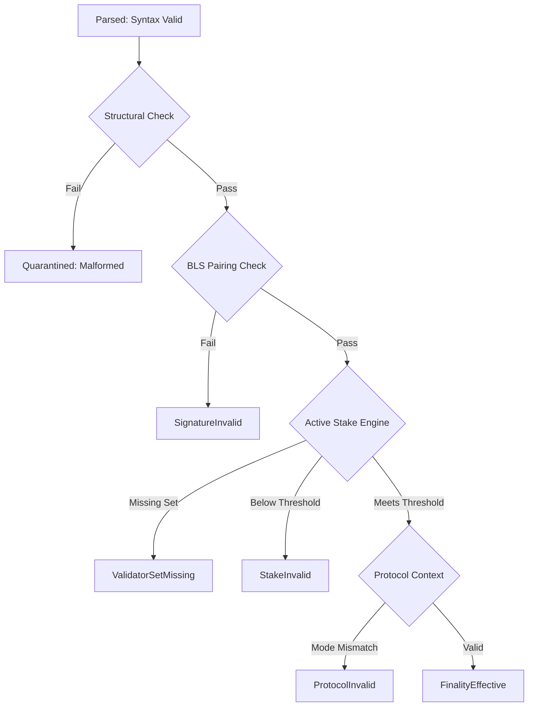

# CHRONO Phase 7 — Consensus & Notarization Matrix

> **Document Status**: Production Complete / Protocol Audited  
> **Target Engine**: CHRONO Core v0.1.0  
> **Protocol Conformance**: SIMD-0326, SIMD-0298, SIMD-0337, SIMD-0384, Agave 4.3+, Solana BLS Signatures 3.4.0

---

## 1. Consensus Lifecycle State Model

CHRONO distinguishes 11 explicit consensus lifecycle states. Under no circumstances are states collapsed (e.g., `Observed ≠ Canonical`, `Parsed Certificate ≠ Verified Certificate`, `Notarized ≠ Finalized`).

| Consensus Lifecycle State | Description | Transition Invariant | Upstream Evidence |
| :--- | :--- | :--- | :--- |
| `OBSERVED` | Received via shred, gRPC, or WebSocket stream from an external provider. | Initial state upon event ingestion. Unverified. | Raw blockheader, entry, or shred arrival. |
| `PROCESSED` | Deshredded, framed, and structural signature verified. | Internal syntax and framing valid. | Agave bank processing pipeline. |
| `CANDIDATE` | Represents a candidate bank in a slot under SIMD-0326. | Branch point established; lineage tracked. | Multiple candidate banks possible per slot. |
| `CANONICAL` | Resolved as the preferred head of the valid fork for that slot. | Supported by valid lineage and parent consistency. | Longest chain / heaviest fork resolution. |
| `NOTARIZED` | Backed by a valid BLS notarization certificate (≥60% stake). | Notarization does NOT equal finalization. | Votor notarization certificate. |
| `FINALIZABLE` | Certificate verified; active stake threshold confirmed; pending finality execution. | Cryptographic and stake checks passed. | Verification engine output. |
| `FINALIZED` | Cryptographically notarized via fast-path (≥80% stake) or fallback-path (≥60% stake). | Irreversible consensus commitment. | Fast path BLS certificate or fallback root. |
| `ROOTED` | Legacy TowerBFT 32-lockout boundary or Alpenglow finalized root. | Prunes state prior to rooted slot. | Cluster rooted slot boundary. |
| `ABANDONED` | Candidate bank invalidated due to an `UpdateParent` fast leader handover marker. | All uncommitted execution routes purged. | SIMD-0337 `UpdateParent` marker. |
| `REPLACED` | State superseded by a reorg or parent fork switch. | Historic record kept; active routing halted. | Fork reorg evidence. |
| `SKIPPED` | Slot produced no blocks and was skipped by cluster consensus. | Backed by explicit timeout/skip evidence. | Skip certificate or leader timeout. |

---

## 2. Certificate Validation Engine & BLS Cryptography

### 2.1 Cryptographic Core
- **Library**: `solana-bls-signatures = "3.4.0"` (BLST pairing-friendly elliptic curve BLS12-381).
- **Pairing Equation**: Authenticates aggregate signature $\sigma \in G_1$ against aggregate public key $PK_{agg} \in G_2$ over canonical message $M$:
  $$e(\sigma, g_2) == e(H(M), PK_{agg})$$
- **Point Compression**: Compressed public keys (48 bytes) and signatures (96 bytes) are decompressed and verified against curve subgroups.
- **Tamper Protection**: Any alteration of the message, blockhash, slot, or signature bytes fails decompression or the pairing check, producing `SignatureInvalid`.

### 2.2 Validation Status Hierarchy
Every certificate evaluated by `CertificateEngine::verify_certificate` returns a structured status:

### 2.3 Certificate Types

| Certificate Kind | Purpose | Minimum Threshold | Target Protocol Mode |
| :--- | :--- | :--- | :--- |
| `FinalizeFast` | Single-round 1-hop finalization | 80.00% (8000 bps) | Alpenglow / Votor Fast Path |
| `FinalizeFallback` | Multi-round 2-hop finalization | 60.00% (6000 bps) | Alpenglow Fallback Path |
| `Notarize` | Candidate bank notarization | 60.00% (6000 bps) | Alpenglow Intermediate Notarization |
| `Skip` | Validator leader skip confirmation | 60.00% (6000 bps) | Leader Timeout / Skip Consensus |
| `UnknownCertificateType` | Future or experimental types | N/A (Quarantined) | Unknown / Forward Compatibility |

---

## 3. Integer-Safe Stake Engine (`StakeEngine`)

### 3.1 Arithmetic Safety Standard
- Floating-point arithmetic is strictly prohibited for threshold and finality acceptance.
- All calculations operate on integer lamports (`u64`) and basis points (`u32`, where $100.00\% = 10,000 \text{ bps}$).
- Cross-multiplications use 128-bit integers (`u128`) to prevent overflow:
  $$\text{participation\_bps} = \left( \frac{\text{participating\_lamports} \times 10,000}{\text{total\_active\_lamports}} \right) \text{ as } u32$$

### 3.2 Epoch Isolation & Validator Set Correctness
- Active validator stake sets are registered per epoch (`EpochStakeTable`).
- When evaluating a certificate for slot $S$, the engine resolves the active epoch $E = \lfloor S / \text{slots\_per\_epoch} \rfloor$.
- **Isolation Guarantee**: The engine never silently falls back to the newest or default stake table. If the validator set for epoch $E$ is not registered, the certificate is rejected with `StakeCalculationStatus::ValidatorSetMissing`.
- **Empirical Proof**: As verified in `test_phase7_epoch_transition_isolation`, identical certificate bytes with identical signers yield `FinalityEffective` in Epoch 10 (80.00% stake) but `StakeInvalid` in Epoch 11 (50.00% stake) when active stake increases.

---

## 4. Canonical Fork Resolution

The `CanonicalResolver` reconciles competing candidate banks within a slot and across slots based on protocol evidence:

1. **Global Identity**: Identity is established exclusively via `(slot, blockhash)`. Local Agave `bank_id` is never used for cluster-wide reconciliation.
2. **Parent Invalidation (`UpdateParent`)**: Upon receipt of an `UpdateParent` marker (SIMD-0337), the abandoned parent candidate bank and all uncommitted execution routes branching from it are immediately invalidated (`BankFreshnessTier::Abandoned`).
3. **Evidence Ranking**:
   - Level 1: Cryptographic Fast Finality Certificate (80% stake)
   - Level 2: Cryptographic Fallback Finality Certificate (60% stake)
   - Level 3: Votor Notarization Certificate (60% stake)
   - Level 4: Sealed Block Footer with verified bank hash (SIMD-0298)
   - Level 5: Candidate Bank with valid parent lineage
4. **Tie Breaking**: If two candidate banks possess identical evidence, the state remains `CANDIDATE` until consensus notarization arrives. CHRONO never selects a winner based on arrival order or UI aesthetics.
